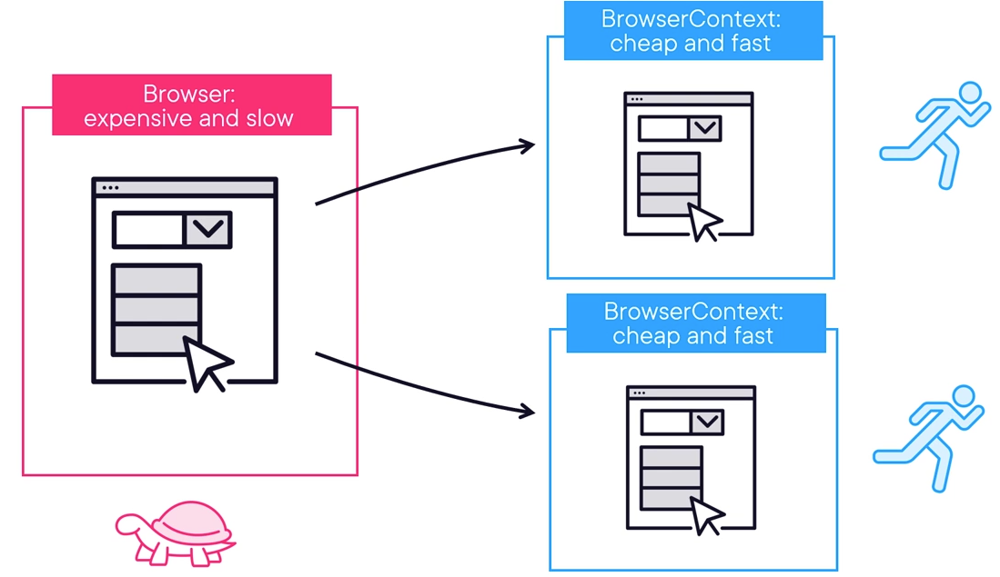

# Playwright
Es un framework de automatización de navegadores para pruebas y scraping web desarrollado por Microsoft. Permite 
 interactuar con páginas web de manera programática, soportando múltiples navegadores como Chromium, Firefox y WebKit.

## BrowserContext
El `BrowserContext` en Playwright es un **entorno de navegación aislado** dentro de un navegador. Es similar a un 
 perfil de navegador o una sesión de incógnito: tiene su propio almacenamiento, cookies, caché y estado, completamente 
 independiente de otros contextos.



## Concepto Básico

```java
Browser browser = playwright.chromium().launch();

// Cada contexto es completamente independiente
BrowserContext context1 = browser.newContext();
BrowserContext context2 = browser.newContext();

Page page1 = context1.newPage(); // Página en contexto 1
Page page2 = context2.newPage(); // Página en contexto 2 (aislada)
```

## Ventajas del BrowserContext

**1. Aislamiento Total**
- Cookies separadas
- LocalStorage independiente
- Sesiones distintas
- Caché propio

**2. Eficiencia**
- Crear un contexto es más rápido que lanzar un navegador completo
- Reutilizas la instancia del navegador

**3. Paralelización**
- Puedes ejecutar múltiples tests en paralelo con un solo navegador

## Recomendaciones de Uso

### ✅ Patrón Recomendado: Un Contexto por Test

```java
public class PlaywrightTest {
    static Playwright playwright;
    static Browser browser;
    BrowserContext context;
    Page page;

    @BeforeAll
    static void launchBrowser() {
        playwright = Playwright.create();
        browser = playwright.chromium().launch();
    }

    @BeforeEach
    void createContextAndPage() {
        // Nuevo contexto limpio para cada test
        context = browser.newContext();
        page = context.newPage();
    }

    @Test
    void test1() {
        page.navigate("https://example.com");
        // Test con estado limpio
    }

    @Test
    void test2() {
        page.navigate("https://example.com");
        // Otro test, contexto independiente
    }

    @AfterEach
    void closeContext() {
        context.close(); // Limpia el contexto
    }

    @AfterAll
    static void closeBrowser() {
        browser.close();
        playwright.close();
    }
}
```

### ✅ Configuración del Contexto

```java
BrowserContext context = browser.newContext(
    new Browser.NewContextOptions()
        .setViewportSize(1920, 1080)
        .setLocale("es-PE")
        .setTimezoneId("America/Lima")
        .setPermissions(Arrays.asList("geolocation"))
        .setGeolocation(new Geolocation(-12.0464, -77.0428)) // Lima, Perú
        .setUserAgent("Custom User Agent")
        .setHttpCredentials("user", "password")
        .setIgnoreHTTPSErrors(true)
);
```

### ✅ Manejo de Cookies y Estado

```java
// Guardar estado de autenticación
context.storageState(new BrowserContext.StorageStateOptions()
    .setPath(Paths.get("state.json")));

// Reutilizar estado en otro contexto
BrowserContext newContext = browser.newContext(
    new Browser.NewContextOptions()
        .setStorageState(Paths.get("state.json"))
);
```

### ✅ Interceptar Peticiones

```java
context.route("**/*.{png,jpg,jpeg}", route -> route.abort());

// O modificar respuestas
context.route("**/api/data", route -> {
    route.fulfill(new Route.FulfillRequestOptions()
        .setStatus(200)
        .setBody("{\"mock\": \"data\"}"));
});
```

### ❌ Anti-Patrón: Reutilizar Contexto entre Tests

```java
// MAL - No hagas esto
static BrowserContext context;

@BeforeAll
static void setup() {
    browser = playwright.chromium().launch();
    context = browser.newContext(); // Mismo contexto para todos
}

@Test
void test1() {
    Page page = context.newPage();
    // Cookies y estado se acumulan
}

@Test
void test2() {
    Page page = context.newPage();
    // Este test puede verse afectado por test1
}
```

### ✅ Múltiples Páginas en un Contexto

Útil cuando necesitas simular tabs o ventanas relacionadas:

```java
@Test
void testMultipleTabs() {
    BrowserContext context = browser.newContext();
    
    Page page1 = context.newPage();
    page1.navigate("https://example.com");
    
    Page page2 = context.newPage();
    page2.navigate("https://example.com/login");
    
    // Ambas páginas comparten cookies y sesión
    
    context.close(); // Cierra ambas páginas
}
```

### ✅ Escenarios de Usuario Diferentes

```java
@Test
void testMultipleUsers() {
    // Usuario 1
    BrowserContext adminContext = browser.newContext();
    Page adminPage = adminContext.newPage();
    adminPage.navigate("https://app.com");
    adminPage.fill("#username", "admin");
    
    // Usuario 2 - sesión completamente independiente
    BrowserContext userContext = browser.newContext();
    Page userPage = userContext.newPage();
    userPage.navigate("https://app.com");
    userPage.fill("#username", "user");
    
    // Ejecutan acciones en paralelo sin interferencia
    
    adminContext.close();
    userContext.close();
}
```

### ✅ Configuración para Mobile Testing

```java
BrowserContext mobileContext = browser.newContext(
    new Browser.NewContextOptions()
        .setViewportSize(375, 667)
        .setDeviceScaleFactor(2)
        .setIsMobile(true)
        .setHasTouch(true)
        .setUserAgent("Mozilla/5.0 (iPhone; CPU iPhone OS 14_0...)")
);
```

### ✅ Captura de Eventos

```java
context.onPage(page -> {
    System.out.println("Nueva página abierta: " + page.url());
});

context.onRequest(request -> {
    System.out.println("Request: " + request.url());
});

context.onResponse(response -> {
    System.out.println("Response: " + response.status());
});
```

## Mejores Prácticas Resumidas

1. **Un contexto nuevo por test** para garantizar aislamiento
2. **Reutiliza el Browser** entre tests para eficiencia
3. **Cierra siempre los contextos** para liberar recursos
4. **Usa contextos diferentes** para simular múltiples usuarios
5. **Configura el contexto** según necesites (viewport, locale, permisos)
6. **Guarda el estado** para reutilizar sesiones autenticadas
7. **Aprovecha el aislamiento** para tests paralelos sin interferencia

El BrowserContext es una de las características más poderosas de Playwright porque te permite escribir tests más rápidos, aislados y confiables.